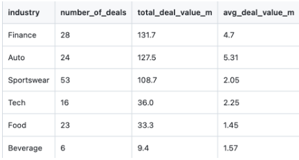
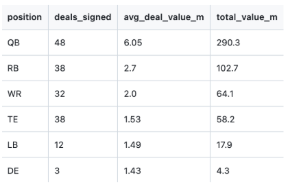
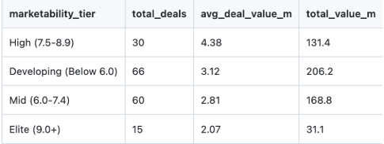
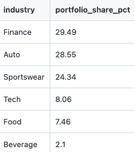
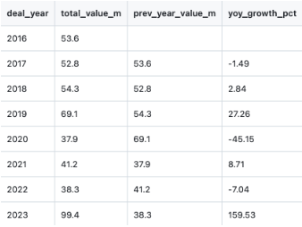
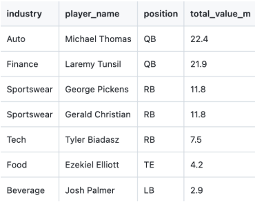
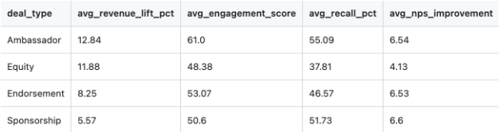

# NFL Sport Agency Endorsement Analytics — Key Insights

---

## Query 1 — Portfolio Overview

```sql
SELECT COUNT(*) AS player_count FROM players;
SELECT COUNT(*) AS brand_count FROM brands;
SELECT COUNT(*) AS deal_count FROM endorsement_deals;
SELECT COUNT(*) AS performance_count FROM deal_performance;
```


**Insight:** The agency currently manages 150 active and historical endorsement 
deals across 64 players and 20 brand partners, generating a total portfolio of 
$446.6M. This establishes a strong baseline for benchmarking future deal targets 
and measuring year-over-year agency growth.

---

## Query 2 — Total Portfolio Value

```sql
SELECT
    ROUND(SUM(deal_value_m), 2) AS total_portfolio_value_m,
    ROUND(AVG(deal_value_m), 2) AS avg_deal_value_m,
    ROUND(MIN(deal_value_m), 2) AS min_deal_value_m,
    ROUND(MAX(deal_value_m), 2) AS max_deal_value_m
FROM endorsement_deals;
```

**Insight:** With an average deal value of $2.98M and a ceiling of $16.4M, the agency has clear room to push deal values upward. The $0.3M floor suggests the agency is taking on low-value deals that may not justify the negotiation resources. The agency should consider setting a minimum deal threshold of $0.5M to protect agent bandwidth.


---

## Query 3 — Total Deal Value by Brand Industry

```sql
SELECT
    b.industry,
    COUNT(e.deal_id) AS number_of_deals,
    ROUND(SUM(e.deal_value_m), 2) AS total_deal_value_m,
    ROUND(AVG(e.deal_value_m), 2) AS avg_deal_value_m
FROM endorsement_deals e
JOIN brands b ON e.brand_id = b.brand_id
GROUP BY b.industry
ORDER BY total_deal_value_m DESC;
```



**Insight:** Despite Sportswear producing the most deals (53), Finance generates the highest total value at $131.7M and Auto commands the highest average deal value at $5.31M per deal. This tells the agency to prioritize Auto and Finance brand relationships over volume-heavy Sportswear deals. Fewer, higher-volume contracts in these two industries will outperform chasing Sportswear volume. Beverage is significantly underrepresented at only 6 deals at 2.1% portfolio share, suggesting an untapped pipeline worth developing.  

---

## Query 4 — Top 10 Most Valuable Deals

```sql
SELECT
    p.player_name,
    p.position,
    b.brand_name,
    b.industry,
    e.deal_year,
    e.deal_value_m,
    e.deal_type,
    e.exclusivity
FROM endorsement_deals e
JOIN players p ON e.player_id = p.player_id
JOIN brands b ON e.brand_id = b.brand_id
ORDER BY e.deal_value_m DESC
LIMIT 10;
```

**Insight:** Every one of the top 10 most valuable deals belongs to a quarterback, confirming that QB representation is the agency’s highest-leverage asset. Auto and Finance brands dominate this tier (3 Auto, 7 Finance), reinforcing the industry priority identified in Query 3. Laremy Tunsil holding 3 of the top 10 sports signals he is the agency’s most commercially valuable client. His contract renewals and brand relationships should be protected at all costs.

---

## Query 5 — Average Deal Value by Position

```sql
SELECT
    p.position,
    COUNT(e.deal_id) AS deals_signed,
    ROUND(AVG(e.deal_value_m), 2) AS avg_deal_value_m,
    ROUND(SUM(e.deal_value_m), 2) AS total_value_m
FROM endorsement_deals e
JOIN players p ON e.player_id = p.player_id
GROUP BY p.position
ORDER BY avg_deal_value_m DESC;
```



**Insight:** QBs lead in every metric including deals signed, average deal value, and total value, which is expected. However the gap between QBs and the next tier (RBs and WRs) represents a significant opportunity. The agency should invest in building the marketability profiles of its top RBs and WRs through media training and social media growth strategies to close the gap. Defensive Ends sitting at the bottom despite their on-field profile suggests the agency is undeserving its defensive clients. Therefore, a dedicated defensive player marketing strategy could unlock untapped brand interest.

---

## Query 6 — Marketability Tier Analysis

```sql
SELECT
    CASE
        WHEN p.marketability_score >= 9.0 THEN 'Elite (9.0+)'
        WHEN p.marketability_score >= 7.5 THEN 'High (7.5-8.9)'
        WHEN p.marketability_score >= 6.0 THEN 'Mid (6.0-7.4)'
        ELSE 'Developing (Below 6.0)'
    END AS marketability_tier,
    COUNT(e.deal_id) AS total_deals,
    ROUND(AVG(e.deal_value_m), 2) AS avg_deal_value_m,
    ROUND(SUM(e.deal_value_m), 2) AS total_value_m
FROM endorsement_deals e
JOIN players p ON e.player_id = p.player_id
GROUP BY marketability_tier
ORDER BY avg_deal_value_m DESC;
```



**Insight:** The most counterintuitive finding in the entire dataset is that Elite tier players (9.0+) are averaging only $2.07M per deal despite their status, while High tier players (7.5-8.9) average $4.38M. This suggests the agency’s Elite-rated players are either under-negotiated or locked into older deals signed before their market value peaked. The agency should immediately audit Elite tier contracts for renewal or renegotiation opportunities. Additionally with only 15 Elite tier deals, there is a concentration risk. The agency needs to develop more players into that bracket.

---

## Query 7 — Industry Portfolio Share

```sql
SELECT
    b.industry,
    ROUND(SUM(e.deal_value_m) * 100.0 /
        (SELECT SUM(deal_value_m) FROM endorsement_deals), 2) AS portfolio_share_pct
FROM endorsement_deals e
JOIN brands b ON e.brand_id = b.brand_id
GROUP BY b.industry
ORDER BY portfolio_share_pct DESC;
```



**Insight:** Finance (29.49%) and Auto (28.55%) together account for nearly 60% of the entire portfolio value, creating significant concentration risk. If either industry pulls back its NFL spending, due to economic conditions or regulatory changes, the agency’s revenue takes a major hit. The agency should actively diversify into Tech and Lifestyle brands to reduce this dependency. Tech at only 8.06% is particularly underdeveloped given the industry’s growing appetite for sports marketing.

---

## Query 8 — Year Over Year Growth

```sql
SELECT
    deal_year,
    ROUND(SUM(deal_value_m), 2) AS total_value_m,
    LAG(ROUND(SUM(deal_value_m), 2)) OVER (ORDER BY deal_year) AS prev_year_value_m,
    ROUND(
        (SUM(deal_value_m) - LAG(SUM(deal_value_m)) OVER (ORDER BY deal_year)) * 100.0
        / LAG(SUM(deal_value_m)) OVER (ORDER BY deal_year),
    2) AS yoy_growth_pct
FROM endorsement_deals
GROUP BY deal_year
ORDER BY deal_year;
```



**Insight:** The 2023 surge of 159.53% growth to a record $99.4M total is a strong signal, but the three years of negative growth (2017, 2020, 2022) reveal vulnerabilities. The 2020 decline of -45.15% is almost certainly COVID-related and understandable, but 2017 and 2022 declines need investigation: Were key players retiring, were deals expiring without renewal, or was the agency losing clients to competitors? Understanding those dips is as strategically important as celebrating 2023’s peak.

---

## Query 9 — Top Earner Per Industry

```sql
SELECT industry, player_name, position, total_value_m
FROM (
    SELECT
        b.industry,
        p.player_name,
        p.position,
        ROUND(SUM(e.deal_value_m), 2) AS total_value_m,
        RANK() OVER (
            PARTITION BY b.industry
            ORDER BY SUM(e.deal_value_m) DESC
        ) AS industry_rank
    FROM endorsement_deals e
    JOIN players p ON e.player_id = p.player_id
    JOIN brands b ON e.brand_id = b.brand_id
    GROUP BY b.industry, p.player_name, p.position
)
WHERE industry_rank = 1
ORDER BY total_value_m DESC;
```



**Insight:** Several position-industry mismatches stand out as red flags. Michael Thomas and Laremy Tunsil leading Auto and Finance respectively as QBs makes sense. However, George Pickens and Tyerl Bladasz leading Sportswear and Teach as a RB and RB respectively suggests the agency’s WRs and QBs in those categories are underperforming commercially. The agency should analyze why its skill position players aren’t dominating Sportswear deals the way they should be. Ezekiel Elliot leading Food as a TE and Josh Palmer leading Beverage as a LB at relatively low values ($4.2M and $2.9M) also signals that these industries need stronger player matchmaking.

---

## Query 10 — Deal Performance by Type

```sql
SELECT
    e.deal_type,
    ROUND(AVG(dp.brand_revenue_lift_pct), 2) AS avg_revenue_lift_pct,
    ROUND(AVG(dp.social_engagement_score), 2) AS avg_engagement_score,
    ROUND(AVG(dp.customer_recall_pct), 2) AS avg_recall_pct,
    ROUND(AVG(dp.nps_delta), 2) AS avg_nps_improvement
FROM deal_performance dp
JOIN endorsement_deals e ON dp.deal_id = e.deal_id
GROUP BY e.deal_type
ORDER BY avg_revenue_lift_pct DESC;
```



**Insight:** Ambassador deals are clearly the highest-performing deal structure across every metric that matters: highest revenue lift (12.84%), highest engagement (61.0), and highest consumer recall (55.09%). Despite this, they are likely underrepresented in the portfolio relative to standard Endorsement deals. The agency should make converting existing Endorsement relationships into Ambassador structures a top negotiating priority at renewal time. Equity deals underperforming on engagement and recall despite their premium posting suggests the agency needs to build stronger activation requirements into Equity contracts to ensure brands are actually leveraging the player relationships.

---
